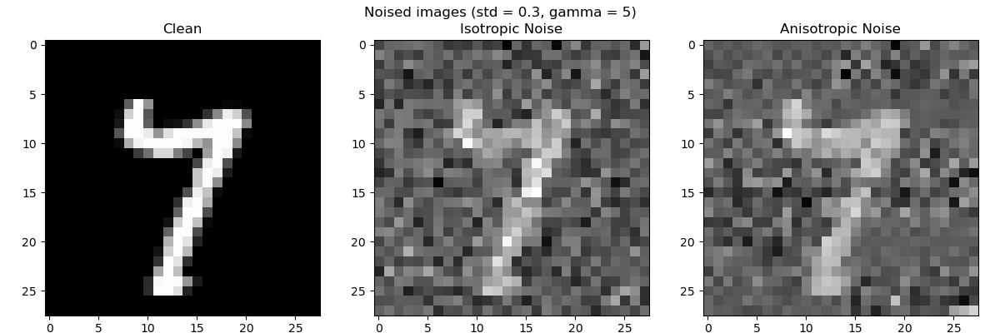
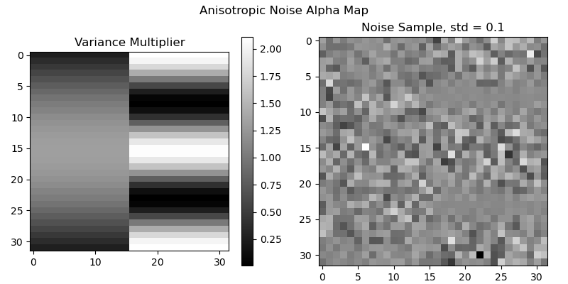

# REAN: Reduced Equivariance for Anisotropic Noise



This repository contains code and experiments for studying how strict and relaxed rotational equivariance behave on rotated-MNIST classification under isotropic and anisotropic noise. The code was made for the author's final project in Applied Math 226, Theory of Neural Computing at Harvard University, Fall 2025. The project report is available in `rean_report.pdf`. 

Note that the main entry point for running experiments is the notebook `notebooks/experiment.ipynb`. This is because the author used Google colab to run the original experiment in order to have acess to GPU acelleration.
The notebook can be run on CPU, but will be much faster with a CUDA-enabled GPU.

## Abstract

Equivariant neural networks have been shown to be more data-efficient and generalizable than non-equivariant counterparts when the target function is known to be equivariant to a symmetry group. Prior work also suggests that when symmetries are only approximate, approximately equivariant models can outperform both standard and strictly equivariant models while retaining strong performance on fully equivariant tasks. In this project, we test that hypothesis using rotated-MNIST with added isotropic and anisotropic noise. Contrary to our initial hypothesis, the fully equivariant model outperforms both the relaxed-equivariant and standard CNN baselines across all tested noise settings.

## Figures

Anisotropic noise map used in the experiments:



## Repository Layout

- `rean/`: core package code (models, data pipeline, training, utilities)
- `notebooks/experiment.ipynb`: main experiment entry point
- `experiments/`: saved runs and plots (`production/` contains report results, and should not be modified)
- `figures/`: container for figures to use in this README
- `tests/`: unit tests for models/data/training utilities
- `rean_report.pdf`: full project report

## Installation

Requirements:

- Python 3.9+
- A working PyTorch install for your platform (CPU or CUDA)

Install the package from the repository root:

```bash
python -m pip install -e .
```

Install test dependencies (optional):

```bash
python -m pip install -e ".[test]"
```

## Running Experiments (Notebook Entry Point)

The primary workflow is in `notebooks/experiment.ipynb`.

1. Open the notebook in Jupyter, VS Code, or Google Colab (recommended for GPU access).
2. Run the setup cells that resolve repository paths and imports.
3. Configure the sweep variables (model, noise type, noise level, epochs, etc.).
4. Run the training/evaluation cells.

Outputs are written under the selected experiment directory:

- `experiments/<experiment_name>/runs/...`: per-run checkpoints and JSON metrics
- `experiments/<experiment_name>/plots/...`: generated PNG plots and test-accuracy CSVs

## Reproducing Report Results

The `experiments/production/` directory contains the canonical run outputs used for the report:

- `experiments/production/runs/`
- `experiments/production/plots/`

## Testing

This repository comes with a few minimal unit tests.
to run the tests, from repository root:

```bash
pytest -q
```

## Contact

- Author: Lucas Steinberger
- Email: `lsteinberger@fas.harvard.edu`
- Issues: [Open a GitHub issue](https://github.com/steinburglar/REAN/issues)
